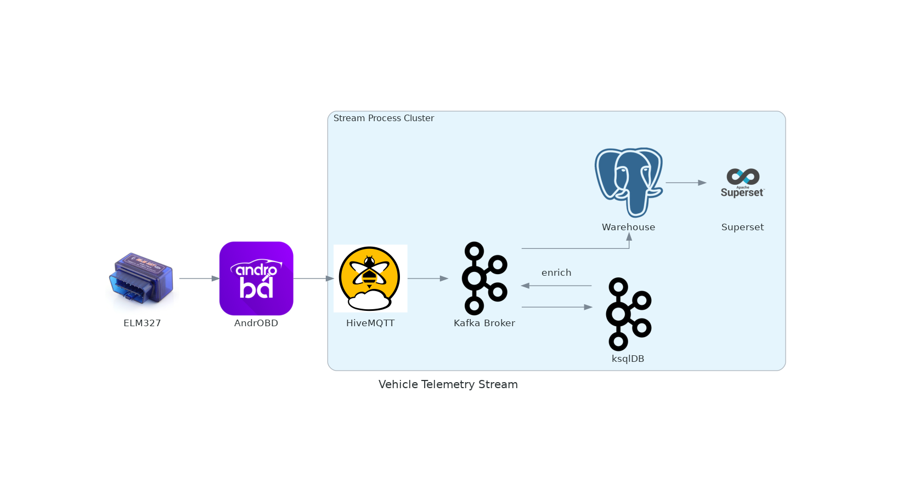
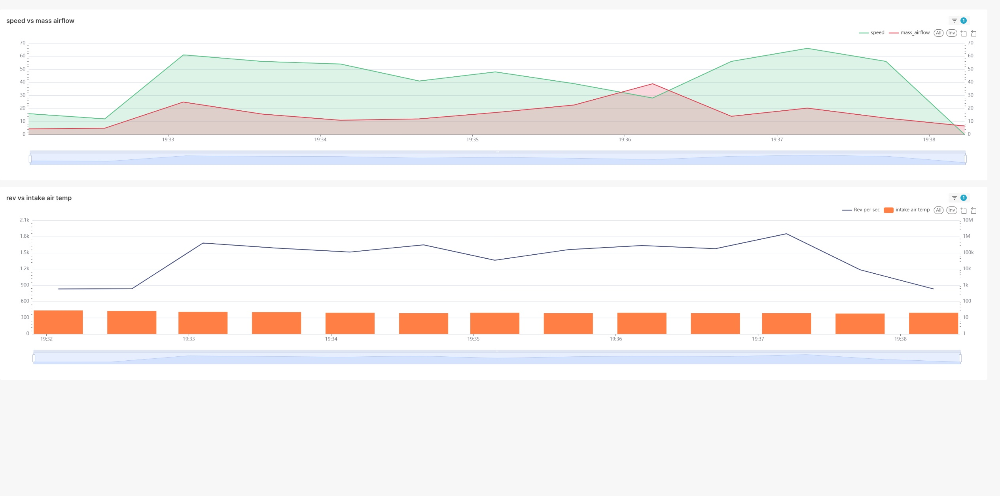

# Streaming car telemetry data using OBD and Kafka

# Architecture

# Step 1
- Download and set up [AndrOBD](https://github.com/fr3ts0n/AndrOBD/wiki)
- Download and set up AndrOBD plugin `MqttPublisher`. (Use Fdroid to search for MqttPublisher)
# Step 2
Create free account on  [HiveMQ cloud](https://www.hivemq.com/company/get-hivemq/), you get 10GB free without any constraint. Once you create account, create MQTT broker and use credentials to populate MqttPublisher configuration.

# Step 3
Generate some data (turn on your vehicle :D), and confirm that data is being streamed to your mqtt broker.

# Step 4
Once you confirm data is being streamed to your mqtt broker, proceed with creating account on [Confluent cloud](https://confluent.cloud/signup). You have 400$ free credits without any constraints.

# Step 5
Go through tutorial to set up your kafka cluster and ksqldb cluster.

# Step 6
Add and configure your source connector for `HiveMQTT` broker
- I used `ExtractTopic` and `TopicRegexRouter` to create topic for each metric

# Step 7 (Create ksqldb streams)
I used ksqldb streams to enrich and transform data to avro schema, so it could be easily ingested by sink connectors

# Step 8 (Set up local connect instance)
I used [confluent cloud all in one docker compose file](https://github.com/confluentinc/cp-all-in-one/blob/latest/cp-all-in-one-cloud/docker-compose.connect.yml) to set up connect instance locally.
I used confluent hub cli to download and install JDBC sink connector.
Configure JDBC sink connector and make sure to get theses API KEYS
- schema registry
- kafka cluster api keys

# Step 9 (Set up local superset instance)
I used docker to spin up super set instance

# Result
