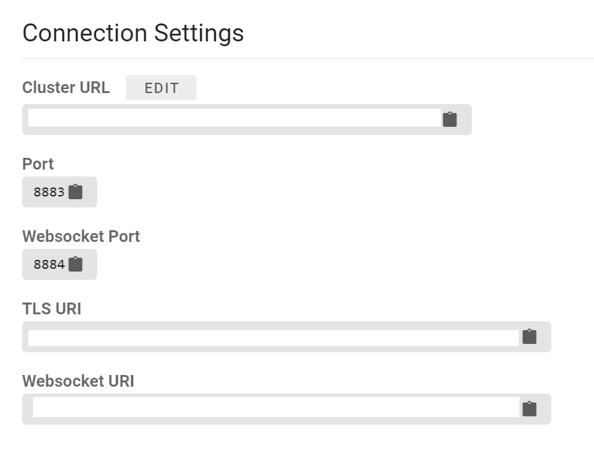
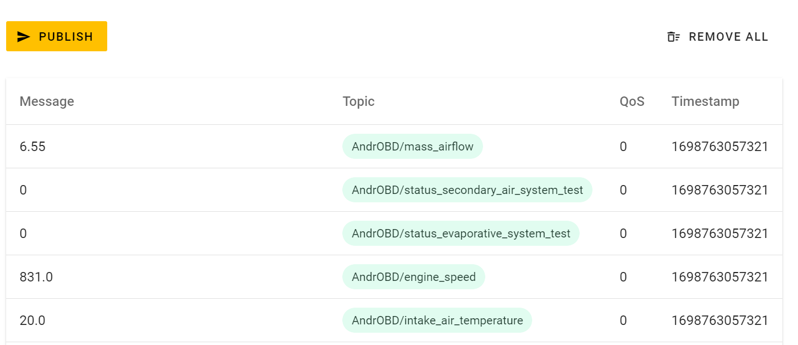
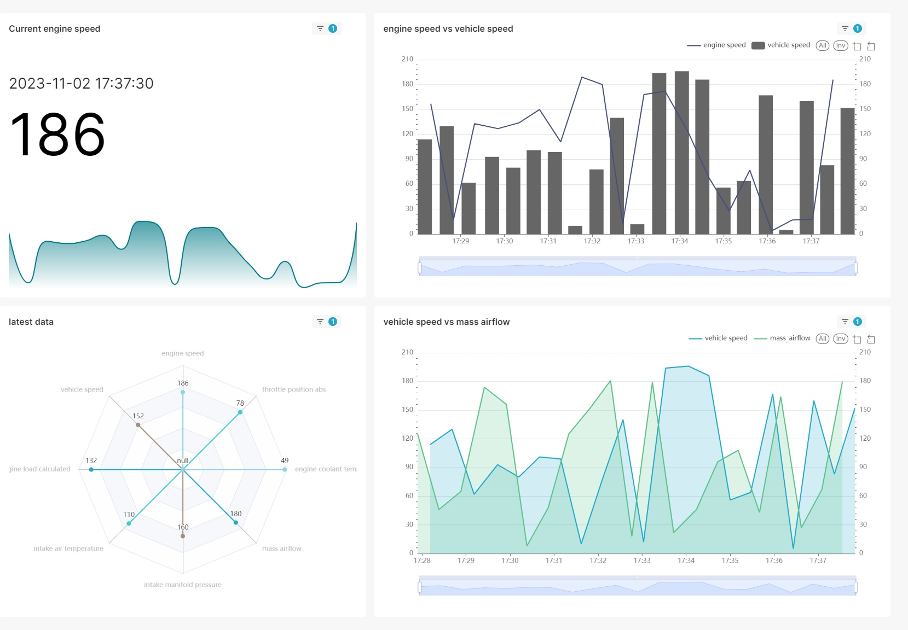

# Stream and visualize vehicle telemetry using OBDII, Kafka and Superset
## Near realtime Superset dashboard for vehicle telemetry obtained using OBDII

https://github.com/planck-length/vehicle-telemetry-kafka-stream/assets/53899528/97b41740-9c90-4e80-a2ab-f9e4066cab2e


# Table of Contents
1. [Dashboard](#near-realtime-superset-dashboard-for-vehicle-telemetry-obtained-using-obdii)
1. [Prequisites](#prequisites)
1. [Architecture overview](#architecture)
1. [Setup](#setup)
    1. [Setup AndrOBD](#step-1---setup-androbd)
    1. [Setup HiveMQTT broker](#step-2---setup-hivemqtt-broker)
    1. [Confirm data is passing through](#step-3---generate-data)
    1. [Setup Kafka on confluent](#step-4---setup-kafka-on-confluent)
    1. [Configure MQTT source connector](#step-5---configure-mqtt-source-connector)
    1. [Create ksqlDB streams](#step-6---create-ksqldb-streams)
    1. [Configure Sink connectors](#step-7---configure-sink-connector)
    1. [Configure dashboard](#step-8---configure-superset)
1. [TODO]()
    1. [Replace Postgres]()
    1. [Performance Monitoring]()
    1. [Data quality Monitoring]()
    1. [Predictive Analyitcs]()


# Prequisites
- [ELM327](https://www.amazon.com/Launchh-Professional-Bluetooth-Interface-Diagnostic/dp/B07Z65HX5X/ref=sr_1_4?keywords=elm327+bluetooth&qid=1698746835&sr=8-4)
- [AndrOBD with MQTT Publisher plugin](https://github.com/fr3ts0n/AndrOBD/wiki)
- [Confluent cloud account](https://confluent.cloud/signup/)
- [HiveMQ cloud account](https://www.hivemq.com/)
- [Docker compose](https://docs.docker.com/compose/)

# Architecture


# Setup
## Step 1 - Setup AndrOBD
- Download and set up [AndrOBD](https://github.com/fr3ts0n/AndrOBD/wiki)
- Download and set up AndrOBD plugin `MqttPublisher`. (Use Fdroid to search for MqttPublisher)
## Step 2 - Setup HiveMQTT broker
Create free account on  [HiveMQ cloud](https://www.hivemq.com/company/get-hivemq/), you get 10GB free without any constraint. Once you create account, create MQTT broker and use credentials to populate MqttPublisher configuration.


## Step 3 - Generate data
Generate some data (turn on your vehicle :D), and confirm that data is being streamed to your mqtt broker.
- Subscribe to topics.

- Check published data.


## Step 4 - Setup Kafka on Confluent
Once you confirm data is being streamed to your mqtt broker, proceed with creating account on [Confluent cloud](https://confluent.cloud/signup). You have 400$ free credits without any constraints.

## Step 5 - Configure MQTT source connector
Add and configure your source connector for `HiveMQTT` broker.
In order to create topic per each metric, I used SMT's [`ExtractTopic`](https://docs.confluent.io/platform/current/connect/transforms/extractfield.html) and [`TopicRegexRouter`](https://docs.confluent.io/platform/current/connect/transforms/topicregexrouter.html) to create topic for each metric.

## Step 6 - Create ksqldb streams
Data comming from HiveMQTT broker follow this message schema:
```
key: "AndrOBD/engine_load_calculated",
header: [
  {
    "key": "mqtt.message.id",
    "value": "0"
  },
  {
    "key": "mqtt.qos",
    "value": "0"
  },
  {
    "key": "mqtt.retained",
    "value": "false"
  },
  {
    "key": "mqtt.duplicate",
    "value": "false"
  }
]
value: 34.117645
```
JDBC Sink connector need schema in order to work, so we need to do some transformations on data. And while we're doing it we may as well add some ingest timestamp here. 
I used ksqldb streams to enrich and transform data to avro schema and to add timestamp to our sink topic.

Ksql for creating source stream
```
CREATE STREAM `AndrOBD_engine_speed` (`value` DOUBLE, `key` STRING KEY) 
WITH (CLEANUP_POLICY='delete',
      KAFKA_TOPIC='AndrOBD_engine_speed', 
      KEY_FORMAT='KAFKA', 
      VALUE_FORMAT='JSON', 
      WRAP_SINGLE_VALUE=false);
      
```
With above we get `source stream` with following message:

```
{
  "key": "AndrOBD/engine_speed",
  "value": 1494
}
```

Ksql for transformation and creating sink topic
```
CREATE STREAM `AndrOBD_enriched_engine_speed` WITH (VALUE_FORMAT='AVRO') AS 
SELECT  `AndrOBD_engine_speed`.`key` `key`, 
        `AndrOBD_engine_speed`.`value` `value`,  
        FORMAT_TIMESTAMP(FROM_UNIXTIME(`AndrOBD_engine_speed`.ROWTIME), 'yyyy-MM-dd HH:mm:ss.SSS') `kafka_ingest_timestamp` 
    FROM `AndrOBD_engine_speed` `AndrOBD_engine_speed` 
    PARTITION BY `AndrOBD_engine_speed`.`key` EMIT CHANGES;
```

With above ksql we get `sink stream/topic` with following message and schema:
```
{
  "key": "AndrOBD/engine_speed",
  "value": 1494,
  "kafka_ingest_timestamp": "2023-10-27 19:00:53.375"
}
```
## Step 7 - Configure sink connector
I used [confluent cloud all in one docker compose file](https://github.com/confluentinc/cp-all-in-one/blob/latest/cp-all-in-one-cloud/docker-compose.connect.yml) to set up connect instance locally. 
Configured JDBC Sink connector
```
{
  "name": "PostgresJdbcSinkConnectorConnector",
  "config": {
    "connector.class": "io.confluent.connect.jdbc.JdbcSinkConnector",
    "key.converter": "org.apache.kafka.connect.storage.StringConverter",
    "value.converter": "io.confluent.connect.avro.AvroConverter",
    "errors.tolerance": "none",
    "errors.log.enable": "true",
    "errors.log.include.messages": "true",
    "topics.regex": "^pksqlc-wdzzwAndrOBD_enriched_.*",
    "connection.url": "jdbc:postgresql://postgres/postgres",
    "connection.user": "<POSTGRES_USER>",
    "connection.password": "<POSTGRES_PASSWORD>",
    "dialect.name": "PostgreSqlDatabaseDialect",
    "pk.mode": "kafka",
    "auto.create": "true",
    "value.converter.schema.registry.basic.auth.user.info": "<SCHEMA_API_KEY>:<SCHEMA_SECRET_KEY>",
    "value.converter.basic.auth.credentials.source": "USER_INFO",
    "value.converter.schema.registry.url": "<SCHEMA_REGISTRY_URL>"
  }
}
```
>The API key for Confluent Cloud Schema Registry is distinct from the API key you created for Kafka clusters in the same environment, per the Quick Start for Confluent Cloud. Follow this [guide](https://docs.confluent.io/cloud/current/get-started/schema-registry.html) to obtain correct API keys for schema registry.


## Step 8 - Configure Superset
Follow through guide for [configuring](https://superset.apache.org/docs/installation/installing-superset-using-docker-compose) and [connecting to postgres](https://superset.apache.org/docs/databases/postgres). For creating it's first dataset, chart and dashboard one can follow this [guide](https://superset.apache.org/docs/creating-charts-dashboards/creating-your-first-dashboard). 

For simple dashboard I created 4 charts:
- engine speed vs vehicle speed (mixed timeseries chart)
- mass airflow vs vehicle speed (mixed timeseries chart)
- latest data (radar chart)
- current engine speed (big number with trendline)


# TODO
## Replace Postgres
Use [druid](https://druid.apache.org/) or Spark
## Performance Monitoring/Optimization
TBD
## Data quality Monitoring
- Anomaly detection
- Detecting bad data
## Predictive Analytics
Trends
